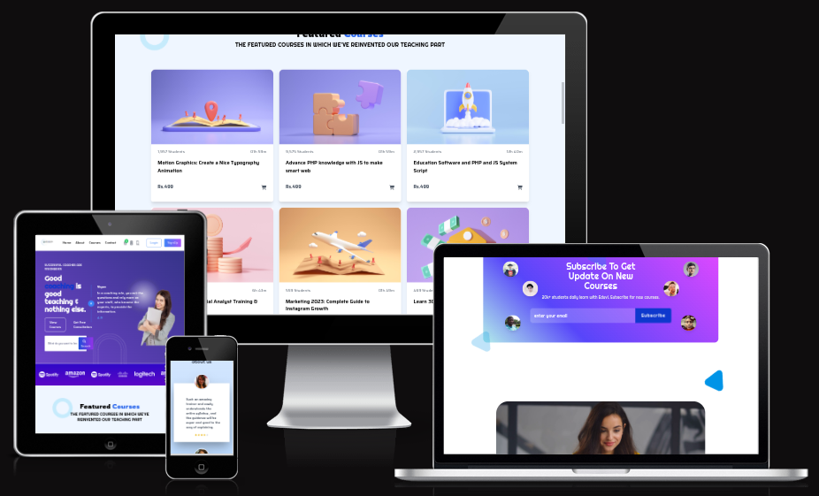

# Tom's Course Hub

[Link to the deployed site](https://tom-courses-hub.netlify.app)

## Description of the Project

Tom's Course Hub is a static website designed to showcase and promote online courses. The website provides information about various courses, categories, and testimonials from students. It also includes a subscription form for users to receive updates on new courses. The website is built using HTML, Tailwind CSS, and JavaScript, with a focus on responsive design and user-friendly navigation.

The website features a hero section with a gradient background, a glowing circle effect, and a search bar for users to find courses. It also includes sections for featured courses, top categories, testimonials, and a subscription form. The footer contains links to different sections of the website, social media icons, and copyright information.

The website is hosted on *Netlify*: https://tom-courses-hub.netlify.app, and is optimized for mobile devices. It is also accessible to users with screen readers and keyboard navigation.

## Technologies Used

- **Programming Languages:**
  - HTML
  - CSS
  - JavaScript

- **Frameworks:**
  - [Tailwind CSS](https://tailwindcss.com/) - A utility-first CSS framework for rapidly building custom user interfaces.

- **Tools:**
  - [Font Awesome](https://fontawesome.com/) - A toolkit for vector icons and social logos.
  - [Google Fonts](https://fonts.google.com/) - A library of free licensed font families.
  - [Tailwind CSS CDN](https://cdn.tailwindcss.com/) - A CDN for quickly integrating Tailwind CSS into the project.
  - [Netlify](https://www.netlify.com/) - A cloud platform for hosting and deploying web applications.

- **Other:**
  - [Favicon Generator](https://favicon.io/) - Used to generate favicons for the website.
  - [Random User Generator](https://randomuser.me/) - Used to generate random user images for testimonials and subscription sections.

## Rights Reserved

Copyright © 2025 TomDCoding. All Rights Reserved.

This project is licensed under the terms of the MIT license. You are free to use, modify, and distribute the code for personal or commercial purposes, but you must include the original copyright notice and license terms in any copies or substantial portions of the software.

---

For more information or inquiries, please contact the project owner.